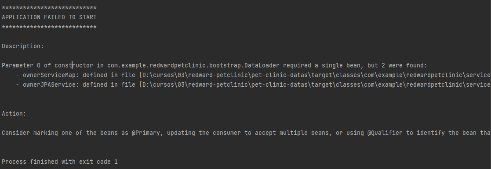

# redward-petclinic

- Closes #2.  closes issue.
- OJO multi Module al hacer refactor:
  - Ojo con la ruta al hacer refactoR!! needs package and route 
  como en app origina con artifact inverted
    (com.example.redwardpetclinic)

- maven-release-plugin with developer connection
```
mvn release:prepare
mvn:release:perform
```

Beware el dataload (boostrap se hace en el modulo web no el de datos) , pure model.

> tip: to DI:: ..private final ...Service; Alt+Enter> add Constructor parameter.

### [Thymeleaf_CheatSheet](https://github.com/engma/thymeleaf-cheat-sheet)
- thymelaf template have inheritance so BEWARE of the html sintax and structure!!!!

### [(How to manage ENV variables  PDF_here)](https://github.com/friedelredward/redward-petclinic/blob/main/ExternalPropertiesOverview.pdf)
- Also spring Cloud Config as alternative
- DOCs Externalized Configuration : https://docs.spring.io/spring-boot/docs/2.4.3/reference/html/spring-boot-features.html#boot-features-external-config

### JPA
[(101  PDF_here)]("https://github.com/friedelredward/redward-petclinic/blob/main/JPA+Entity+Relationships.pdf")

- Spring data JPA uses a framework like hibernate to 
enhance the persistence API.
- Declaring an Implementation *For the same service* will produce:

  - so it's very important to declare 1 primary or set the profiles functinality 
  as intended in the beginning
````java
@Service
@Profile("springdatajpa") //< ---this is not gonna be invoked when not active.profile 
public class OwnerJPAService implements OwnerService { /*...*/}
````


